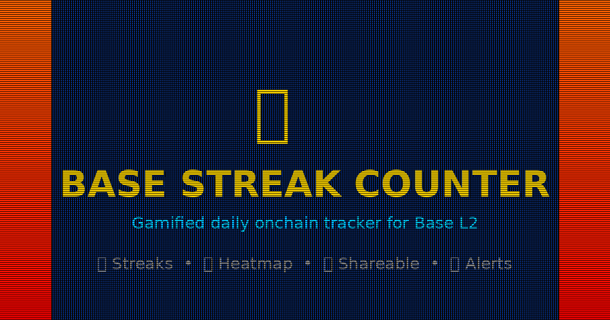
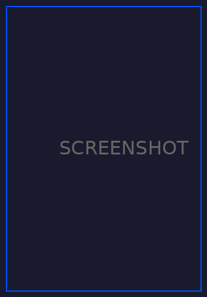
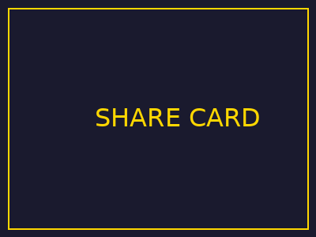

<p align="center">
  
</p>

<h1 align="center">🔥 Base Streak Counter</h1>

<p align="center">
  <strong>Gamified daily onchain activity tracker for Base L2</strong>
</p>

<p align="center">
  <a href="#features">Features</a> •
  <a href="#installation">Installation</a> •
  <a href="#how-it-works">How It Works</a> •
  <a href="#screenshots">Screenshots</a> •
  <a href="#share-your-streak">Share</a>
</p>

<p align="center">
  
  
  
</p>

---

## Why?

Like Snapchat streaks, but for degens. Track your consecutive days of onchain activity on Base. Don't break the streak! 🔥

---

## Features

🔥 **Streak Tracking** - Count consecutive days with onchain transactions

📊 **Activity Heatmap** - GitHub-style visualization of your last 90 days

⏰ **Countdown Timer** - See exactly how long until your streak resets

🔔 **Streak Warnings** - Get notified before your streak breaks

📤 **Shareable Cards** - Generate images to flex on Twitter/X

📈 **Stats Dashboard** - Best streak, total active days, "on Base since"

🆓 **100% Free** - No API keys needed, uses free BaseScan API

---

## Screenshots

<p align="center">
  
</p>

<p align="center">
  
</p>

---

## Installation

### Quick Install (Developer Mode)

1. **Download** this repo (Code → Download ZIP) or clone it:
   ```bash
   git clone https://github.com/danbuildss/base-streak-counter.git
   ```

2. **Open Chrome** and go to `chrome://extensions/`

3. **Enable Developer Mode** (toggle in top right)

4. **Click "Load unpacked"** and select the `base-streak-counter` folder

5. **Done!** Click the extension icon and enter your wallet address

---

## How It Works

### Streak Calculation

```
1. Fetch all transactions (normal, internal, token transfers)
2. Group by UTC day
3. Count consecutive days from today/yesterday
4. Current streak = unbroken chain of active days
```

### What Counts as Activity?

- ✅ Sending ETH or tokens
- ✅ Swapping on DEXs
- ✅ Minting NFTs
- ✅ Contract interactions
- ✅ Receiving tokens (you're the recipient)
- ✅ Any transaction where your wallet is involved

### Streak Resets

Your streak resets at **midnight UTC** if you have no transactions that day.

---

## API Usage

Uses the free BaseScan API (no key required for basic endpoints):

- `txlist` - Normal transactions
- `txlistinternal` - Internal transactions  
- `tokentx` - ERC20 token transfers

Rate limited to ~5 calls/second, which is plenty for personal use.

---

## Share Your Streak

Click the **📤 SHARE** button to generate a shareable image:

1. Copy to clipboard
2. Download as PNG
3. Post on Twitter/X with your stats

**Sample tweet:**
```
My Base streak: 42 days 🔥

Haven't missed a day onchain since last month.

Are you tracking your streak?
[image]
```

---

## Customization

### Check Interval

Edit `background.js`:
```javascript
const CHECK_INTERVAL = 30; // Minutes between checks
```

### Streak Warnings

Enable/disable notifications in the extension popup. Warnings are sent after 6 PM if you haven't transacted that day.

---

## Project Structure

```
base-streak-counter/
├── manifest.json      # Extension config
├── background.js      # Service worker (data fetching, notifications)
├── popup.html         # Main UI
├── popup.css          # Retro gaming styles
├── popup.js           # UI logic, heatmap, share card
├── icons/             # Extension icons
└── assets/            # README images
```

---

## Roadmap

- [ ] ENS/Basename support
- [ ] Multiple wallet tracking
- [ ] Weekly/monthly streak challenges
- [ ] Leaderboard (opt-in)
- [ ] Firefox support
- [ ] More share card designs

---

## Contributing

PRs welcome! Ideas:

- New streak milestones/badges
- Different heatmap themes
- Social features
- Performance improvements

---

## License

MIT - Do whatever you want with it.

---

## Support

If you find this useful:

- ⭐ Star this repo
- 🐦 Share your streak on [Twitter/X](https://twitter.com/intent/tweet?text=Tracking%20my%20Base%20streak%20%F0%9F%94%B5%F0%9F%94%A5&url=https://github.com/YOUR_USERNAME/base-streak-counter)
- 🔵 Keep building on Base

---

<p align="center">
  Built with 🔥 for the Base ecosystem
</p>

<p align="center">
  <a href="https://base.org">
    
  </a>
</p>
